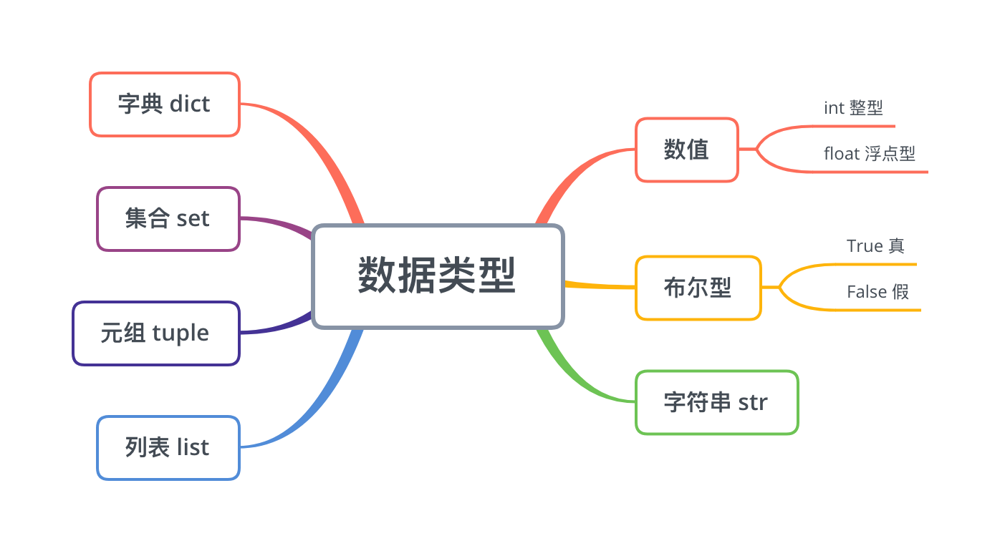

# python 基础

##  注释

python中的注释分为 `单行注释` 和 `多行注释`。

`单行注释` 的语法：

```python
# 被注释的内容
```

`多行注释` 可以使用两种格式进行。

- 使用6个双引号进行：

```python
"""
	第一行被注释的内容
	第二行被注释的内容
	第三行被注释的内容
	……
”“”
```

- 使用6个单引号进行：

```python
'''
	第一行被注释的内容
	第二行被注释的内容
	第三行被注释的内容
	……
'''
```


## 变量

变量，可以理解为在存储数据的时候，给当前数据所在的内存地址取一个名字。方便我们阅读而已

```python
变量名 = 值
```

`变量名` 的命名规则须满足 *标识符命名规则* ：

- 由数字、字母、下划线组成
- 不能数字开头
- 不能使用内置关键字
- 严格区分大小写

```python
A = 'a' 
a = 'a'
_A = 'a'
a123 = 123
```


## 数据类型

python中的基本数据类型：



可以通过 **type()** 函数来查看一个变量的数据类型：

```python
a = 1
#可以打印出'a'的数据类型
print(type(a))  # <class 'int'>

b = 1.1
print(type(b))	# <class 'float'>

c = 'abc'
print(type(c))	# <class 'str'>

d = [10, 20, 30] # 列表list
print(type(d))	# <class 'list'>

e = (10, 20, 30) # 元组tuple
print(type(e)) #<class 'tuple'>

f = {10, 20, 30} # 集合 set
print(type(f)) # <class 'set'>

g = {'name': 'Jake', 'age': 30}
print(type(g)) # <class 'dict'>
```


## 格式化输出

| 格式符号 |      格式化说明      |
| :------: | :------------------: |
|    %s    |        字符串        |
|    %d    |  有符号的十进制整数  |
|    %f    |   浮点数(四舍五入)   |
|    %c    |         字符         |
|    %u    |   无符号十进制整数   |
|    %o    |      八进制整数      |
|  %x或%X  | 十六进制整数(ox或OX) |
|  %e或%E  |      科学计数法      |
|  %g或%G  |  %f和%e(或%E)的简写  |

- `%07d`, 表示输出的整数显示位数为7位，不足时以`0`补全， 超出当前位数则原样输出。

  ```python
  id = 1
  print('%03d' % id) #输出 001
  id2 = 1000
  print('%03d' % id) #输出 1000 原样输出
  ```

- `%.2f`, 表示小数点后显示的小数位数为2位。

  ```python
  f = 2.5 
  print('%.2f' % f)  # 输出 2.50
  f2 = 2.555
  print('%.2f' % f2) # 输出2.56 
  f3 = 2.554
  print('%.2f' % f3) # 输出2.55
  ```

- `%s` 也能输出除字符串之外的其他类型的数据:

  ```python
  a = 100
  b = 2.5555
  c = 'abc'
  print('%s %s %s' % (a, b, c))   #输出：100 2.5555 abc
  ```


`f'{表达式}'` 格式化字符串, **f-格式化字符串** 是 **python3.6** 中新增的格式化方法。

```python
name = 'Jake'
age = 28
print(f'My name is {name}, I am {age}.')  #输出 My name is Jake, I am 28.
```


## 输入

`input` 会把接收到的任意用户输入的数据都当做 **字符串** 处理。

```python
name = input('请输入你的名字:')
print(f'你输入的名字是{name}')
```

转换数据类型常用的一些函数：

`int()`  `float()`  `str()`  `list()`  `tuple()`  `eval()`  


**eval()** 函数：执行一个字符串表达式， 并返回表达式的值。

```python
x = 10 
eval('x * 2')  # 20
a = '1'
eval(a)  #得到一个整数数值1
b = '1.1'
eval(b) #得到一个浮点数值1.1
c = '[1,2,3]'
eval(c) #得到一个list [1,2,3]
d = '(1,2,3)'
eval(d) #得到一个tuple （1，2，3）
e = '{"a":1,"b":2}'
eval(e) #得到一个dict {"a":1,"b":2}
```


## 运算符

1. 算数运算符

   | 运算符号 |  符号描述  |    例子     |
   | :------: | :--------: | :---------: |
   |    +     |     加     |   1+1 = 2   |
   |    -     |     减     |   2-1 = 1   |
   |    *     |     乘     |  2 * 3 = 6  |
   |    /     |     除     | 6 / 2 = 3.0 |
   |    //    |    整除    | 10 // 3 = 3 |
   |    %     | 取余(取模) | 10 % 3 = 1  |
   |    **    |    指数    | 3 ** 2 = 9  |

2. 赋值运算符

   | 运算符号 | 符号描述 |                 例子                 |
   | :------: | :------: | :----------------------------------: |
   |    =     |   赋值   | 将`=` 右侧的结果赋值给等号左侧的变量 |

   - 单个变量赋值：

   ```python
   a = 1
   ```

   - 多变量赋值：

   ```python
   a, b, c = 1, 1.5, 'Jake'
   ```

   - 多变量赋相同值

   ```python
   a = b = c = 100
   ```

   

3. 复合赋值运算符

   | 运算符号 |     符号描述     |           例子           |
   | :------: | :--------------: | :----------------------: |
   |    +=    |     加法赋值     |   a += 1 ==> a = a + 1   |
   |    -=    |     减法赋值     |   a -=1 ==> a = a - 1    |
   |    *=    |     乘法赋值     |   a *= 2 ==> a = a * 2   |
   |    /=    |     除法赋值     |   a /= 2 ==> a = a / 2   |
   |   //=    |     整除赋值     |  a //= 2 ==> a = a // 2  |
   |    %=    | 取余（取模）赋值 |   a %= 2 ==> a = a % 2   |
   |   **=    |      幂赋值      | a **= 2 ==> a = a \*\* 2 |

   注意：

   ```python
   a += 1 + 3  ==> a += (1 + 3) ==> a = a + (1 + 3)
   a *= 1 + 2  ==> a *= (1 + 2) ==> a = a * (1 + 2)
   #也就是说：复合赋值运算符时，是先进行右侧表达式运算，然后将运算结果再与左侧变量进行复合赋值运算
   ```

   

4. 比较运算符

   `==`、 `!=`、 `>` 、`<`、 `>=`、 `<=` 

5. 逻辑运算符

   `and` 、`or`、`not`

   

   对于**数字之间** 的`and` 运算符，只要有一个值为0，则结果为0，否则结果为最后一个非0数字:

   ```python
   0 and 1   # 输出为0
   1 and 0   # 输出为0
   1 and 2  	# 输出为2
   3 and 1 	# 输出为1
   ```

   对于数字之间的`or` 运算符，只有所有值为0 时，结果才为0， 否则结果为第一个非0 数字：

   ```python
   0 or 1  # 输出为1
   1 or 2  # 输出为1
   ```


## python中的模块使用

1. 导入模块

   ```python
   import random
   ```

2. 使用模块中的功能

   ```python
   random.randint(1, 10) #随机一个[1,10]之间的一个整数
   ```

   

## if 语句

### 1. if 语法：

```python
if 判断条件：
	执行逻辑代码
```

如：

```python
age = 25
if age >= 18:
  	print('已经成年，可以打工啦')
```

### 2. `if ... else ...`

```python
if 判断条件：
		执行逻辑代码
else:
  	执行else下的逻辑代码
```

如：

```python
age = 10 
if age >= 18:
  	print('已经成年，可以打工啦')
else:
  	print('未成年哦！')
```

### 3. `if`多重判断

```python
if 条件1：
		执行逻辑代码
elif 条件2：
		执行逻辑代码
...
else:
  	执行else下的逻辑代码
```

```python
age = 70
if age >= 65:
    print('你年龄太大了，真的不适合这个工作了')
elif age >= 18: 
    print('已经成年，可以打工啦')
else:
    print('未成年哦！')
```


*判断条件的简写*:

```python
(age >= 18) and (age < 65)  ====> (18 <= age < 65)
```

### 4. 三目运算符

语法：

```python
条件成立执行的表达式 if 条件 else 条件不成立执行的表达式
```

```python
a = 10 
b = 30 
c = a if a > b else b  # 得到 c = 30
```


## 循环

### 1. while 循环

- #### 语法：

```python
while 条件：
	执行逻辑代码
```

```python
a = 0 
while a < 5:
  print('a = ', a)
  a += 1
```

在写循环类代码时，一定要注意循环的结束条件，如果结束条件不存在，或者写的有误，就有可能造成“死循环”！

- #### `break`  & `continue`对循环进行控制

`break` ：终于`break`所在的*当前循环*:

```python
a = 0 
while a < 5:
  if a == 3:
    break
  print('a = ', a)
  a += 1
```

```python
j = 1 
while j <= 9: # 这里的while循环不受里层循环中的break影响
	i = 1
	while i <= j: 
		if i == 5:
			break # 此处的break 只会结束内层while循环，但外层的循环还是会继续进行完毕
		i += 1 
	j += 1
```

`continue`: 退出前当一次循环继而执行下一次循环逻辑代码：

```python
a = 0 
while a < 100:
  if a % 2 == 0:
    print('a是一个偶数!')
    a += 1 # 这句很重要，要不然，计数器就不会改变
    continue # 在continue语句之前，一定要注意计数器值的修改，如果不对计数器的值进行修改，很有可能会使代码进行一个“死循环”！
  print('a = ', a)
  a += 1
```

- #### 打印九九乘法表(while循环实现)：

```python
j = 1  #表示行
while j <= 9:
	i = 1 # 表示列
	while i <= j:
		print(f'{i} * {j} = {i * j}', end = '\t')
		i += 1 #一定要记得此处进行计数器加1
	print()
	j += 1 #一定要记得此处进行计数器加1
```


- #### 人与电脑猜拳游戏(while循环实现)：

```python
import random

while True:
	input_txt = input('请你出拳(1-剪刀，2-石头，3-布, Q-退出):')
	if input_txt == 'Q':
		break

	if input_txt != '1' or input_txt != '2' or input_txt != '3':
		continue

	person = int(input_txt) 
	computer = random.randint(1,3) # randint函数包含两个边界值

	if person == computer:
		print('打平手！')
	elif (person == 1 and computer == 3) or (person == 2 and computer == 1) or (person == 3 and computer == 2):
		print('恭喜你，你打败了电脑!')
	else:
		print('你被电脑打败了，再接再厉哦~')
```

### 2. for 循环

- #### 语法：

```python
for 临时变量 in 序列:
  执行逻辑代码
```

```python
s = 'hello world'
for i in s:
  print(i)
```

- #### 通过`break`  和 `continue` 对for循环进行控制。

```python
s = 'hello world'
for i in s:
  if i == 'w':
    break #遇到w结束循环 
  print(i)
```

```python
s = 'hello world'
for i in s:
  if i == 'w':
    continue #不打印w
  print(i)
```


### 3. 循环和else配合使用

当while 或 for与 else配合时，else 下方的代码指的是  **当循环正常结束之后要执行的代码**！

- #### 语法

```python
while或for循环:
  执行逻辑代码
else:
  执行循环正常结束之后要执行的代码
```

```python
i = 1
while i <= 5:
	print(f'i = {i}')
	i += 1
else:
	print('正常结束')
```

- #### `break` \ `continue` 对else的影响

<u>当在循环中由于 `break` 结束时，`else` 语句中的代码就不会执行:</u>

```python
i = 1
while i <= 5:
	if i == 5:
		break 
	print(f'i = {i}')
	i += 1
else:
	print('正常结束') # 此处不会执行，因为循环是由于break导致结束，不是正常结束。
```

`continue` 控制下的循环中，`else` 下的代码是可以正常执行的。

```python
i = 1
while i <= 5:
	if i == 5:
		i += 1
		continue
	print(f'i = {i}')
	i += 1
else:
	print('正常结束')# 这里是能够正常执行的
```


## 字符串

- 字符串的表示方式：

  一对引号：

  ```python
  s = 'Jake'
  s = "Jake"
  ```

  三对引号：

  ```python
  s = """Jake"""
  s = '''Jake'''
  s = """ Hello 
  	world.""" #此处会把换行也进行输出。 
  ```

- 字符串输出

  ```python
  age = 28
  print('我今年%d了' % age)
  print(f'我今年{age}了')
  ```

- 字符串输入

  主要是通过input接受用户的输入

- 下标

  python中的下标是从`0` 开始。

  ```python
  s = 'hello world'
  s[0] #即取s中的第一个字母h
  ```

- **切片**

  切片主要是对操作的对象，截取它的一部分进行操作。

  python中的字符串、列表、元组都支持切片操作。

  语法：

  ```python
  序列[开始位置下标:结束位置下标:步长]
  #不包含结束位置下标，正负整数都可以。
  #步长是选取间隔值，正负整数都可以，默认为1。
  ```

  ```python
  s = 'abcdefghi'
  s[2:4] # cd
  s[2:4:1] #cd
  s[2:4:2] #c
  s[:4] #abcd 不写开始，表示从0下标开始
  s[:] #abcdefghi  选取所有的
  s[:-1] #abcdefgh #当为负整数时，从-1开始，-1为最后一个位置的下标
  s[-1:] #i 不写结束，表示选取到最后
  s[::-1] #ihgfedcba  如果步长为负数，表示倒选取
  s[6:2:-1] # gfed
  s[2:6:-1] # 空 当步长为负数时，开始下标和结束下标的也应倒过来，要不然，选取不到值。因为选取方向与步长方向不致造成。
  ```

- 字符串中的一些常用操作方法

  1. `find(子串, 开始位置下标, 结束位置下标)` 

     ```python
     s = 'hello world, i like python'
     s.find('w') # 6
     s.find('ek')  # -1
     ```

  2. `index(子串, 开始位置下标, 结束位置下标)` 

     ```python
     s = 'hello world, i like python'
     s.index('w') # 6
     s.index('ek')  #ValueError: substring not found 如果子串不存在，index函数会报错
     ```

  3. `count(子串, 开始位置下标, 结束位置下标)`

     ```python
     s = 'hello world, i like python'
     s.count('o') # 3
     s.count('aa') # 0
     ```

  4. `rfind()` 、`rindex()`

  5. `replace(旧子串,新子串,替换次数)`

     ```python
     s = 'hello world, i like python'
     s.replace('o', 'oo')  # 'helloo woorld, i like pythoon'  原s字符串是不会改变的，会返回一个新的字符串
     s.replace('o', 'oo', 1) # 'helloo world, i like python'
     ```

  6. `split(分割字符,分割字符出现的次数)`

     ```python
     s = 'hello world, i like python'
     s.split() # ['hello', 'world,', 'i', 'like', 'python']
     s.split('o') # ['hell', ' w', 'rld, i like pyth', 'n']
     s.split('o', 2) # ['hell', ' w', 'rld, i like python']
     ```

  7. `join()`

     ```python
     ls = ['hello', 'world,', 'i', 'like', 'python']
     '-'.join(ls) # 'hello-world,-i-like-python'
     ```

  8. `capitalize()` 、`title()` 、`lower()`、`upper()`

  9. `lstrip()` 、`rstrip()` 、`strip()`

  10. `ljust(长度, 填充字符)` 、`rjust(长度, 填充字符)` 、`center(长度, 填充字符)`

      ```python
      s = 'hello'
      s.ljust(10, '.') # 'hello.....'
      s.rjust(10, '.') # '.....hello'
      s.center(10, '.') # '..hello...'
      ```

  11. `startswith(子串,开始位置下标, 结束位置下标)`、`endswith(子串,开始位置下标, 结束位置下标)`

      ```python
      s = 'hello world, i like python'
      s.startswith('hel') # True
      s.endswith('no') # False
      ```

  12. `isalpha()` 如果字符串至少有一个字符并且所有字符都是 **字母** 则返回True,否则返回False。

      ```python
      s1 = 'hello'
      s2 = 'hello123'
      s1.isalpha() # True
      s2.isalpha() # False
      ```

      `isdigit()` 如果字符串只包含数字则返回True，否则返回False。

      ```python
      s = '1234'
      s2 = 'hello1234'
      s.isdigit() # True
      s2.isdigit() # False
      ```

      `isalnum()` 如果字符串至少有一个字符并且所有字符都是字母或者数字， 则返回True,否则返回False。

      ```python
      s1 = 'hello1234'
      s2 = 'hello1234-'
      s1.isalnum() # True
      s2.isalnum() # False
      ```

      `isspace()` 如果字符中只包含空白， 则返回True,否则返回False。

      ```python
      s1 = 'hello   '
      s2 = '        '
      s1.isspace() #False
      s2.isspace() #True
      ```


## 列表List 和元组Tuple

列表list和元组tuple的主要不同在于: `列表是可以修改的，而元组不可以。` 

`list`和`tuple` 中都可以存储不同数据类型的数据。

单个元素的元组： `s = ('Jake',)`

*注：当元组中存储的数据为列表时，此时其中的列表数据是可以进行修改。所以一定要注意这一点，尽量不要在元组中存入列表等可以修改的数据类型。*

几乎可以在所有情况下使用列表来代替元组，除了将元组用作字典键时，因为字典键是不能修改的。

- 下标（索引）

  序列中的所有元素都是从 0 开始递增。

  ```python
  students = ['Jake', 'Tom', 'John', 'Cindy']
  students[0] # 'Jake'
  students[-1] # 'Cindy'
  ```

- 切片

  使用切片slice来访问特定范围内的元素。

  ```python
  n = [1, 2, 3, 4, 5, 6, 7]
  n[2:4] # [3,4]
  n[-3:-1] # [5, 6]
  n[-3:-1:2] # [5]
  ```

- 序列相加

  ```python
  [1,2,3] + [4,5]  # [1,2,3,4,5]
  (1,2,3,4) + (5,6) # (1,2,3,4,5,6)
  (1,2) + [3,4] # TypeError: can only concatenate tuple (not "list") to tuple
  #不能“相加”两个不能同类型的序列
  ```

- 乘法

  ```python
  >>> l = [1,2]
  >>> l * 3
  [1, 2, 1, 2, 1, 2]
  >>> l2 = (1,2)
  >>> l2 * 3
  (1, 2, 1, 2, 1, 2)
  ```

- 判断元素是否在序列中: `in` or `not in`

  ```python
  students = ('Jake', 'Tom', 'John', 'Cindy')
  'Jake' in students   # True
  'Jake' not in students # False
  ```

  

### 遍历列表和元组

1. `while` 

   ```python
   students = ('Jake', 'Tom', 'John', 'Cindy')
   i = 0
   while i < len(students):
     print(students[i])
     i += 1
   ```

2. `for`

   ```python
   students = ('Jake', 'Tom', 'John', 'Cindy')
   for i in students:
     print(i)
   ```

   

### `列表list` 添加、删除、修改数据

1. `append()` 在列表结尾追加数据。

   ```python
   students = ['Jake', 'Tom', 'John', 'Cindy']
   students.append('Albert')
   ```

2. `extend()` 在列表结尾追加数据。如果追加的数据是本身也是一个序列，则将这个序列的数据逐一追加到列表结尾。

   ```python
   students = ['Jake', 'Tom', 'John', 'Cindy']
   students.extend('Albert') #此处，因为'Albert'是一个字符串序列，所以会得到这样一个列表：['Jake', 'Tom', 'John', 'Cindy', 'A', 'l', 'b', 'e', 'r', 't'] ，所以在使用extend时，追加的数据应该也是列表或者元组。
   students.extend(['Albert']) # ['Jake', 'Tom', 'John', 'Cindy','Albert']
   
   ```

3. `insert()` 在列表的指定位置增加数据。

   ```python
   students = ['Jake', 'Tom', 'John', 'Cindy']
   students.insert(0, 'Jack') # ['Jack', 'Jake', 'Tom', 'John', 'Cindy']
   students.insert(10, 'Jack') # ['Jack', 'Jake', 'Tom', 'John', 'Cindy', 'Jack'] 此处10下标超出列表的索引范围，所以在最后增加数据
   students.insert(10, ['Jack', 'Tom'])# ['Jack', 'Jake', 'Tom', 'John', 'Cindy', 'Jack', ['Jack', 'Tom']] 
   # 注意： insert函数不会拆分序列数据
   ```

4. `del()` 

   ```python
   students = ['Jake', 'Tom', 'John', 'Cindy']
   del(students[0])  # 此时的students中只有：['Tom', 'John', 'Cindy']
   del(students) # 此时把students进行了删除，删除之后，就不能再进行引用了。如果再对students进行引用 ，就会报错：NameError: name 'students' is not defined
   ```

   

5. `pop()` 删除指定下标的数据，默认为最后一个元素，并返回被删除的数据。

   ```python
   students = ['Jake', 'Tom', 'John', 'Cindy']
   students.pop() # 'Cindy'
   students.pop(10) # IndexError: pop index out of range 当下标超出列表索引范围时，会报错
   
   ```

6. `remove(要移除的数据元素)`  从列表中删除指定数据的第一个匹配项。

   ```python
   students = ['Jake', 'Tom', 'John', 'Cindy', 'Jake']
   # 当remove不存在于列表中的数据时，会报错
   students.remove('Jak') # ValueError: list.remove(x): x not in list
   
   students.remove('Jake') # 只会删除第一个匹配的'Jake' 
   ```

7. `clear()` 清空列表

   ```python
   students = ['Jake', 'Tom', 'John', 'Cindy']
   students.clear() # 此students里面的所有元素都会被删除，成为一个空的列表'[]'
   ```

8. `reverse()` 逆置列表

   ```python
   students = ['Jake', 'Tom', 'John', 'Cindy']
   students.reverse() # 此时，students中的元素顺序变为：['Cindy', 'John', 'Tom', 'Jake'] 
   ```

9. `sort(key=None, reverse=False)` 排序列表, （reverse表示排序规则：True-降序，False-升序）

   ```python
   students = ['Jake', 'Tom', 'John', 'Cindy']
   students.sort() #  此时，students中的元素顺序变为：['Cindy', 'Jake', 'John', 'Tom']
   students.sort(reverse=True) # 此时，students中的元素顺序变为：['Tom', 'John', 'Jake', 'Cindy']
   ```

10. `copy()` 复制列表数据

    ```python
    students = ['Jake', 'Tom', 'John', 'Cindy']
    s = students.copy() 
    ```

    

### 列表嵌套

```python
s = [[1,2,3],[4,5,6],[7,8,9]]
s[0] # [1,2,3]
s[1][0] # 4
```


### 常用函数

1. `index()` 返回指定数据所在的位置的下标，如果查找的数据不存在，则会报错。

   ```python
   students = ['Jake', 'Tom', 'John', 'Cindy']
   students.index('Tom', 0, 3) # 1
   students.index('a') # ValueError: 'a' is not in list
   ```

2. `count(需要进行统计的元素)` 统计指定数据在列表中出现的次数。

   ```python
   students = ['Jake', 'Tom', 'John', 'Cindy', 'Tom']
   students.count('Tom') # 2
   ```

3. `len()` 返回列表的长度。

   ```python
   students = ['Jake', 'Tom', 'John', 'Cindy', 'Tom']
   len(students) # 5
   ```


## 字典dict

字典为可变类型。

创建空字典：

```python
d = {} # 方法一
d2 = dict() #方法二
```

### 常用操作

1. 增\改， 如果key存在则修改对应的值，否则新增这个key\value对。

   ```python
   # 写法：字典序列[key] = value 
   person = {'name': 'Jack', 'age': 28, 'gender': 'F'}
   person['name'] = 'John'
   print(person) # {'name': 'John', 'age': 28, 'gender': 'F'}
   
   person['pid'] = 1
   print(person)  # {'name': 'John', 'age': 28, 'gender': 'F', 'pid': 1}
   ```

2. `del()` 删除字典或者字典中指定key\value对。

   ```python
   person = {'name': 'Jack', 'age': 28, 'gender': 'F'}
   del(person['age'])
   print(person) # {'name': 'Jack', 'gender': 'F'}
   ```

3. `clear()` 清空字典

   ```python
   person = {'name': 'Jack', 'age': 28, 'gender': 'F'}
   person.clear() 
   print(person) # {}
   ```

4. 查找

   ```python
   person = {'name': 'Jack', 'age': 28, 'gender': 'F'}
   person['name'] # 'Jack'
   person['id'] # KeyError: 'id' 这样进行查找时，如果key不存在于字典中，则会报错
   ```

5. `get(key, 默认值)` 

   ```python
   person = {'name': 'Jack', 'age': 28, 'gender': 'F'}
   person.get('name') # 'Jack'
   person.get('id') # None 使用get函数时，如果Key不存在于字典中，会返回None，不会报错
   person.get('id', 10) # 10  
   ```

6. `keys()` 、`values()` 、`items()`  都是返回一个可以迭代的对象

   ```python
   person.keys()  # dict_keys(['name', 'age', 'gender']) 一个可迭代的对象
   for k in person.keys():
     print(k)  #输出字典中的所有key
   
   person.values() # dict_values(['Jack', 28, 'F']) 一个可迭代的对象
   for v in person.values():
     print(v) #输出字典中的所有value
   
   person.items() # dict_items([('name', 'Jack'), ('age', 28), ('gender', 'F')]) 一个可迭代的对象
   for k,v in person.items():
     print(f'key = {k}, value = {v}')
   ```

   

## 集合 set

集合一个很重要的功能就是“去重”，集合里的数据没有重复项。

集合不支持下标索引

```python
#创建空集合
s = set() 

s1 = {1,2,3,4}

# 集合不支持下标索引
s1[0] # TypeError: 'set' object is not subscriptable

s2 = {1,2,3,4,4,4,8} # {1, 2, 3, 4, 8} 会得到一个去重后的数据集合set

s3 = set('hello') # {'e', 'o', 'h', 'l'}

# 一个集合中的各数据的类型也是可以不一样的。
s4 = {1, '9', 'A', 'hello'}

# 但是由于集合需要去重，它的每一个数据项都是需要为hashable的数据项。如果添加的数据为不可hashable的数据类型时，会报错
s5 = {1, '9', 'A', [1,2], 'hello'} # TypeError: unhashable type: 'list'
s6 = {1, '9', 'A', {'a':1}, 'hello'} # TypeError: unhashable type: 'dict'
```

### 常用方法

1. `add()`

   ```python
   s1 = {1,2,3,4} 
   s1.add(4) # 因为4已经存在，所以集合不会发生任何变化
   
   s1.add(5) 
   print(s1) # {1, 2, 3, 4, 5}
   ```

2. `update()` 追加的数据是序列

   ```python
   s1 = {1,2,3,4} 
   s1.update([4,5,6,7])
   print(s1) # {1, 2, 3, 4, 5, 6, 7}
   
   # update追加的数据得是序列，如果不是会报错
   s1.update(100) # TypeError: 'int' object is not iterable
   ```

3. `remove()` 删除集合中指定的数据项，如果数据项不存在则会报错。

   ```python
   s1 = {1,2,3,4} 
   s1.remove(3) 
   print(s1) # {1, 2, 4}
   s1.remove(100)  # KeyError: 100
   ```

4. `discard()` 删除集合中指定的数据项，如果数据项不存在，也不会报错。

   ```python
   s1 = {1,2,3,4} 
   s1.discard(3)
   print(s1)  # {1, 2, 4}
   
   s1.discard(100) # 因为100不存在于s1中，所以什么都不会发生
   ```

5. `pop()` 随机删除集合中的某个数据，并返回被删除的数据项。

   ```python
   s1 = {1,2,3,4}
   d = s1.pop()
   
   # 当集合为空时，pop时会报错 
   s1 = set()
   s1.pop() # KeyError: 'pop from an empty set'
   ```

6. 判断一个数据项是不是在集合中，同样使用 `in` 或者 `not in ` 进行

   ```python
   s1 = {1,2,3,4}
   1 in s1 # True
   100 not in s1 # True
   ```

   

## 数据类型上能通用的运算符总结

|   运算符号   |       说明       |             支持的数据类型             |
| :----------: | :--------------: | :------------------------------------: |
|      +       |       合并       | 字符串、列表、元组（不支持字典和集合） |
|      *       |       复制       | 字符串、列表、元组（不支持字典和集合） |
| in 或 not in | 判断元素是否存在 |     字符串、列表、元组、字典、集合     |

```python
#字符串
>>> s1 = 'abc'
>>> s2 = 'bcd'
>>> s1+s2
'abcbcd'
>>> 'a' in s1
True
>>> s1*2
'abcabc'

#列表
>>> ls1 = ['a', 'b']
>>> ls2 = ['c', 'd']
>>> ls1+ls2
['a', 'b', 'c', 'd']
>>> ls1*3
['a', 'b', 'a', 'b', 'a', 'b']
>>> 'a' in ls1
True

#元组
>>> t1 = (10, 20)
>>> t2 = (30, 40)
>>> t1+t2
(10, 20, 30, 40)
>>> t1*3
(10, 20, 10, 20, 10, 20)
>>> 30 in t1
False

#字典
>>> d1 = {'name': 'Jack'}
>>> d2 = {'gender': 'F'}
>>> d1 + d2
Traceback (most recent call last):
  File "<stdin>", line 1, in <module>
TypeError: unsupported operand type(s) for +: 'dict' and 'dict'

>>> 'Jack' in d1
False
>>> 'name' in d1
True
>>> 'name' in d1.keys()
True
>>> 'name' in d1.values()
False

#集合
>>> set1 = {10, 20}
>>> set2 = {30, 40,20}
>>> set1+set2
Traceback (most recent call last):
  File "<stdin>", line 1, in <module>
TypeError: unsupported operand type(s) for +: 'set' and 'set'
>>> set1*3
Traceback (most recent call last):
  File "<stdin>", line 1, in <module>
TypeError: unsupported operand type(s) for *: 'set' and 'int'
>>> 10 in set1
True
```


`enumerate()` 用于将一个可遍历的数据对象变成一个索引序列:

```python
>>> s = enumerate('abcd')
>>> for i in s:
>>>   print(i)
(0, 'a')
(1, 'b')
(2, 'c')
(3, 'd')
```


## 推导式

推导式主要用于化简代码。

- 列表推导式

  ```python
  # 1 使用while创建一个list
  ls = []
  i = 0
  while i < 5:
    ls.append(i)
    i += 1
    
  # 2 使用for创建一个list
  ls = []
  for i in range(5):
    ls.append(i)
    
  # 3 列表推导式创建, 代码明显少了很多！！
  ls = [i for i in range(20)]
  
  # 带if条件的列表推导式
  ls = [i for i in range(20) if i % 2 == 0]
  
  # 实现嵌套循环, 第一个'for'循环是最外层循环，第二个for是次外层循环，依此类推，可以实现N层嵌套
  ls = [(x,y) for x in range(1,3) for y in range(4)] # [(1, 0), (1, 1), (1, 2), (1, 3), (2, 0), (2, 1), (2, 2), (2, 3)]
  #相当于如下嵌套：
  ls = []
  for x in range(1,3):
    for y in range(4):
      ls.append((x,y))
  ```

- 字典推导式

  快速合并列表为字典或提取字典中的目标数据。

  ```python
  dict1 = {str(i): i * i for i in range(10)} # {'0': 0, '1': 1, '2': 4, '3': 9, '4': 16, '5': 25, '6': 36, '7': 49, '8': 64, '9': 81}
  
  # 将两个列表合并成一个字典，要注意下标越界的问题。
  ls1 = ['name', 'age', 'gender']
  ls2 = ['Jack', 28, 'F']
  dict1 = {ls1[i]: ls2[i] for i in range(len(ls1))} # {'name': 'Jack', 'age': 28, 'gender': 'F'}
  
  numbers = {'Jack': 1000, 'John': 1500, 'Tom': 1832, 'Albert': 800}
  #提取数据 
  c = {k: v for k, v in numbers.items() if v >= 1000} # {'Jack': 1000, 'John': 1500, 'Tom': 1832}
  ```

- 集合推导式

  ```python
  ls = [4,5,5,7,8]
  #集合有去重的功能，所以只会得到4个元素
  set1 = {i*i for i in ls} # {16, 25, 64, 49}
  ```


## 函数

实现代码的更高效的重用。

1. 变量的作用域（局部变量和全局变量）

   ```python
   # 在函数内修改全局变量
   a = 1
   def test_a():
     global a # 通过global关键字声明a是全局变量， 即使a 在外部没有声明，通过global关键字之后，a 在外部也通过被访问，但尽量避免这种做法！！！！
     a = 2 # 此时修改时就会修改全局变量a。
   ```

2. 参数

   - 位置参数

     ```python
     def test(name, gender):
       pass
     test('Jack', 'F') # 传递参数必须与定义参数的顺序、个数一致。
     ```

   - 关键字参数

     ```python
     def test(name, gender, age):
       pass
     
     test('Jack', age=28, gender='F')
     test('Albert', gender='F',age = 18)
     # 如果有位置参数时，位置参数必须在关键字参数的前面，关键字参数之间没有顺序。
     ```

   - 缺省参数(默认参数)

     ```python
     # 位置参数必须出现在默认参数之前
     def test(name, age, gender= 'F'):
       pass
     
     test('Tom', 18)
     test('Tom', 18, 'F') 
     ```

   - 不定长参数(可变长度参数)

     ```python
     #1 不定长度的位置参数传递(包裹位置参数传递)
     def test(*args):
       pass
     
     test(1)
     test('a', 1)
     
     #2 不定长度的关键字参数传递（包裹关键字参数传递）
     def test(**args):
       pass 
     
     test(name='Jack')
     test(name='Jack', ago = 28)
     ```

3. 元组、字典拆包

   ```python
   #返回一个元组
   def test():
     return 1, 2
   # 定义两个变量接受函数返回的元组的数据
   a, b = test()
   
   def test(*args, **kwargs):
     pass
   set1 = (14,5,2)
   dict1 = {'name': 'Jack', 'age':28}
   # 1 在元组前面加一个星号*
   # 2 在字典前面加两个星号**
   test(*set1, **dict1) 
   
   dict1 = {'a': 1, 'b': 2}
   a, b = dict1 # 此时a,b得到的是dict1字典的key 
   ```

4. 引用

   python中，值是靠引用来传递的。


## lambda表达式

语法:

```python
lambda 参数列表: 表达式
# lambda表达式的参数可有可无
# lambda表达式能接收任何数量的参数，但只能返回一个表达式的值
```

1. `lambda` 的参数形式

   - 无参数

     ```python
     f = lambda: 'Jack'
     ```

   - 一个参数

     ```python
     f = lambda x: x
     ```

   - 默认参数

     ```python
     f = lambda x, y, z=1: x+y+z
     ```

     

   - 可变参数 `*args`  、 `**kwargs`

     ```python
     f = lambda *args: args
     print(f(1,2,3)) #输出 (1,2,3)
     
     f = lambda **kwargs: kwargs
     print(f(name='Jack', age=28, gender='F')) #输出 {'name': 'Jack', 'age': 28, 'gender': 'F'}
     ```

2. 带判断的lambda表达式

   ```python
   f = lambda x, y: x if x>y else y
   ```

3. 列表数据按字典中的KEY进行排序

   ```python
   students = [
     {'name': 'Jack', 'age': 18},
     {'name': 'Tom', 'age': 28},
     {'name': 'Albert', 'age': 19},
   ]
   
   students.sort(key=lambda x: x['name']) #默认为升序排序
   # [{'name': 'Albert', 'age': 19}, {'name': 'Jack', 'age': 18}, {'name': 'Tom', 'age': 28}]
   
   students.sort(key=lambda x: x['age'], reverse = True) #降序 [{'name': 'Tom', 'age': 28}, {'name': 'Albert', 'age': 19}, {'name': 'Jack', 'age': 18}]
   ```


## 内置的三个常用高阶函数

### 1. `map(func, *iterables)` 

将传入的函数变量`func` 作用到 `iterables` 变量的每个元素上，并将结果组成新的迭代器返回。

```python
>>> ls = [1,2,3,4,5,6]
>>> result = map(lambda x: x**2, ls)
>>> print(list(result))
[1, 4, 9, 16, 25, 36]
```

### 2. `reduce(function, iterable[, initializer])`  

首先先对列表中的第1、2个元素使用`function` 函数之后，将得到的结果再与列表中的第3个元素使用`function`进行运算，依此类推下去。 

其中 `function` 必须接收2个参数。 `reduce` 函数在 `functools` 模块中，使用之前，需要先导入。

```python
>>> import functools
>>> ls = [1,2,3,4,5,6]
>>> result = functools.reduce(lambda x,y: x+y, ls)
>>> print(result)
21
```

### 3. `filter(function, iterable)` 

用于过滤序列， 把不符合条件的元素过滤掉，返回一个filter对象（迭代器对象）。

```python
>>> ls = [1,2,3,4,5,6]
>>> result = filter(lambda x: x % 2 == 0 , ls)
>>> print(list(result))
[2, 4, 6]
```


## 文件操作

1. `open(file, mode='r', buffering=-1, encoding=None, errors=None, newline=None, closefd=True, opener=None)`

文件的访问模式mode：其中`r`、`w`、`a` 为3个主模式。

| 模式 | 描述                                                         |
| :--- | :----------------------------------------------------------- |
| t    | 文本模式 (默认)。                                            |
| x    | 写模式，新建一个文件，如果该文件已存在则会报错。             |
| b    | 二进制模式。                                                 |
| +    | 打开一个文件进行更新(可读可写)。                             |
| r    | 以只读方式打开文件。文件的指针将会放在文件的开头。这是默认模式。如果文件不存在 ，会报错。 |
| rb   | 以二进制格式打开一个文件用于只读。文件指针将会放在文件的开头。这是默认模式。一般用于非文本文件如图片等。 |
| r+   | 打开一个文件用于读写。文件指针将会放在文件的开头。           |
| rb+  | 以二进制格式打开一个文件用于读写。文件指针将会放在文件的开头。一般用于非文本文件如图片等。 |
| w    | 打开一个文件只用于写入。如果该文件已存在则打开文件，并从开头开始编辑，即原有内容会被删除。如果该文件不存在，创建新文件。 |
| wb   | 以二进制格式打开一个文件只用于写入。如果该文件已存在则打开文件，并从开头开始编辑，即原有内容会被删除。如果该文件不存在，创建新文件。一般用于非文本文件如图片等。 |
| w+   | 打开一个文件用于读写。如果该文件已存在则打开文件，并从开头开始编辑，即原有内容会被删除。如果该文件不存在，创建新文件。 |
| wb+  | 以二进制格式打开一个文件用于读写。如果该文件已存在则打开文件，并从开头开始编辑，即原有内容会被删除。如果该文件不存在，创建新文件。一般用于非文本文件如图片等。 |
| a    | 打开一个文件用于追加。如果该文件已存在，文件指针将会放在文件的结尾。也就是说，新的内容将会被写入到已有内容之后。如果该文件不存在，创建新文件进行写入。 |
| ab   | 以二进制格式打开一个文件用于追加。如果该文件已存在，文件指针将会放在文件的结尾。也就是说，新的内容将会被写入到已有内容之后。如果该文件不存在，创建新文件进行写入。 |
| a+   | 打开一个文件用于读写。如果该文件已存在，文件指针将会放在文件的结尾。文件打开时会是追加模式。如果该文件不存在，创建新文件用于读写。 |
| ab+  | 以二进制格式打开一个文件用于追加。如果该文件已存在，文件指针将会放在文件的结尾。如果该文件不存在，创建新文件用于读写。 |

2. `read([size])` 

   从文件读取指定的字节数，如果未给定或为负则读取所有。

   ```python
   file = open('test.txt', 'r')
   file.read() # 读取所有
   file.read(-1)# 读取所有
   file.read(10)# 读取10个字节数的内容
   file.close()
   ```

3. `readlines([size])` 

   把文件中的内容进行一次性读取，并且返回一个列表，其中每一行作为列表中的一个元素。

   若给定sizeint>0，返回总和大约为sizeint字节的行, 实际读取值可能比 sizeint 较大, 因为需要填充缓冲区。

   ```python
   file = open('test.txt', 'r')
   file.readlines()
   
   file.close()
   ```

4. `readline()` 读取整行

   ```python
   file = open('test.txt', 'r')
   file.readline()
   file.readline()#每执行一次读取一行，一般结合循环语句使用
   file.close()
   ```

5. `seek(偏移量, 起始位置)`

   起始位置：0-文件开头，1-当前位置，2-文件结尾

   ```python
   file = open('test.txt', 'r')
   f.seek(5, 0) # 表示先从文件开头偏移5个字节
   c = f.read()
   file.close()
   ```

   

## `os`模块

`os`模块提供了非常丰富的函数用于操作 文件 和 文件夹。


## 异常

### 1. 语法

```python
try:
  可能发生错误的代码
except:
  处理出现异常的代码
else: # 可以没有这个节点
  没有异常会执行的代码
finally: # 可以没有这个节点
  无论是否有异常都会被执行的代码
```

### 2. 捕获（多个）指定异常

```python
#捕获单个异常
try:
  可能发生错误的代码
except 异常类型:
  处理出现异常的代码
  
#捕获多个异常
try:
  可能发生错误的代码
except (异常类型, 异常类型, ...):
  处理出现异常的代码
```

### 3. 获取异常描述信息

```python
try:
  可能发生错误的代码
except (异常类型, 异常类型, ...) as message:
  处理出现异常的代码
```

### 4. 捕获所有异常

```python
try:
  可能发生错误的代码
except Exception as e:
  处理出现异常的代
```

### 5. 异常的else

```python
try:
  a = 10 / 0
except Exception as e:
  print(e)
else:
  print('else表示的是如果没有异常，就会执行到else中的代码，如果有异常就不会执行else 中的代码')
```

### 6. 异常的finally

```python
try:
  f = open('test.txt', 'r')
except Exception as e:
  f = open('test.txt', 'w')
else:
  print('没有异常，执行到我')
finally:
  f.close() # 无论是否有异常，都会执行finally 中的代码。
```

### 7. 自定义异常类

```python
class LongInputError(Exception):
  def __init__(self, length, max_len):
    self.length = length
    self.max_len = max_len
    
  def __str__(self):
    return f'你输入的长度{self.length}, 超过了最大长度{self.max_len}'
  
def test():
  try:
    c = input('请输入你的名字：')
    if len(c) > 10:
      raise LongInputError(len(c), 10) # 自定义异常通过 raise 抛出。
  except Exception as e:
    print(e)
  else:
    print('OK')
```


## 模块

### 1. 导入模块的方式 

```python
import 模块名
import 模块名, 模块名, ... #尽量不要把多个模块导入写在一行里
from 模块名 import 功能名, 功能名, ... 
from 模块名 import *
import 模块名 as 别名
from 模块名 import 功能名 as 别名
```

```python
import math
from math import sqrt
from math import *
import time as tt
from time import sleep as sl
```

注：

- 自己的文件名最好不要与已有的模块名重名，否则会导致一些模块功能无法使用。
- 使用 `from 模块名 import 功能名` 的时候，如果功能名 重复，调用 到的是最后定义或导入的功能名。

### 2. python解析器对模块的搜索顺序

模块搜索路径存储在 `system` 模块中的 `sys.path` 变量中。 

1. 当前目录
2. 如果不在当前目录下，则搜索`PYTHONPATH` 下的每个目录
3. 最后会察看默认路径，这个根据操作系统的不同，而不同。一般不会用到这步。

### 3. `__name__` 

```python
# 这个只有在当前文件中调用时，会才执行，其他地方导入这个文件时，是不符合 __name__='__main__'条件的。
if __name__ == '__main__':
  # 可以用来执行一些测试之类的代码
  pass
```

### 4. `__all__` 

如果一个模块文件中有 `__all__` 变量时，当使用 `from 模块名 import *` 导入时（也只对这种导入方式起作用），只能导入`__all__` 列表中的元素，没有在这个列表中的元素都不会被导入。

```python
# 模块test_m文件中的内容：
__all__ = ['test_a']

def test_a():
  print('test_a')

def test_b():# 没有在__all__列表中
  print('test_b')
  
  

# 在其他地方导入test_m模块
from test_m import *
test_a()
test_b()# 因为没有在 __all__列表中，所以外部不能导入，会报错 NameError: name 'test_b' is not defined
```

但是，如果通过`import test_m` 方式导入时，`__all__` 是不起作用的。

```python
import test_m
test_m.test_a()
test_m.test_b() # 这时，是可以执行的。
```


## 包

当一个文件夹下有 `__init__.py` 时，这时，这个文件夹就是一个 **包**。

### 导入包

```python
# 第1种导入方法
import 包名.模块名
```

在`__init__.py` 文件中添加 `__all__` 变量，用来控制允许外部在通过 `from 包名 import *`导入时的模块列表。

```python
# 第2种导入方法，此方法受__all__ 变量列表中的限制
from 包名 import *
```


## 闭包

**闭包形成的条件**：在函数嵌套的前提下，内部函数使用了外部函数的变量，外部函数返回了内部函数。

在闭包内修改外部函数的变量需要使用 `nonlocal` 关键字。

```python
def f_out():
  num = 1
  def f_inner(n):
		nonlocal num  
    num += n
  return f_inner
```


## 装饰器

就是给已有函数增加额外功能的函数，它本质上就是一个闭包函数。

```python
#装饰器的语法格式：
def decorator(fn):
  def inner():
    # 此处可以添加执行函数之前的其他逻辑代码块
    fn()
    # 此处可以添加执行函数之后的其他逻辑代码块
  return inner
```

**特点**：

- 不修改已有函数的源代码
- 不修改已有函数的调用方式
- 给已有函数增加额外的功能

装饰器的执行时间：当含有装饰器的模块加载完成以后， 装饰器就会立即执行对已有函数进行装饰。 不管被装饰过的函数是否被调用 执行。

```python
import time

# 用于统计函数的执行时间
def get_run_time(func):
  def inner():
    begin = time.time()
    func()
    end = time.time()
    result = end - begin
    print('函数耗时：', result)
    
  return inner

@get_run_time
def test():
  for i in range(1000000):
    print(i)
```

### 对带参数的函数进行装饰

```python
# 装饰器的内部函数的参数要与被装饰的函数参数保持一致。
def decorator_func(func):
  def inner(n1, n2):
    print('装饰中。。。。。。。')
    func(n1,n2)
  return inner

@decorator_func
def add_num(n1, n2):
  result = n1+n2
  print(result)
```

### 通用的装饰器函数做法

```python
def decorator(func):
  def inner(*args, **kwargs):
    print('此处可以添加相关的处理逻辑')
    func(*args, **kwargs)
    print('此处可以添加相关的处理逻辑')
  return inner
```

### 多个装饰器的执行过程

**由内到外依次对函数进行装饰！**

```python
def add_div(func):
  def inner():
    result = f'<div>{func()}</div>'
    return result
  return inner

def add_p(func):
  def inner():
    result = f'<p>{func()}</p>'
    return result
  return inner

# 先执行add_p装饰器，再执行add_div装饰器 ===》 add_div(add_p(test)))
@add_div
@add_p
def test():
  return 'Hello World.'

print(test()) # <div><p>Hello World.</p></div>

```

### 带参数的装饰器

```python
# 带参数的装饰器，需要多嵌套一层函数来处理参数！！！！

def add_html(html_type):
  def decorator(func):
    def inner():
      result = f'<{html_type}>{func()}</{html_type}>'
      return result
    return inner
  return decorator


@add_html('div')
@add_html('p')
def test():
  return 'Hello World.'

print(test()) # <div><p>Hello World.</p></div>
```

### 类装饰器

```python
# 使用类作为装饰器时，主要是要在类中实现 __call__ 方法

class MyDecorator:
  def __init__(self, func):
    self.__func = func
  
  # 实现__call__方法，让对象变成可调用 的对象
  def __call__(self, *args, **kwargs):
		print('此处可以添加相关的处理逻辑')
		self.__func(*args, **kwargs)
		print('此处可以添加相关的处理逻辑')

@MyDecorator
def test():
  print('test')
```


# 面向对象编程

面向对象的三大特性：**封装、继承、多态**。

对象属性既可以在类外面添加和获取，也能在类里面添加和获取。

`__init__()`  构造方法

`__str__()` 

`__del__()`


当一个类有多个父类的时候，默认使用第一个父类中的同名属性和方法。

```python
class A:
  def __init__(self):
    self.name = 'A'
    
  def test(self):
    print('A test')
    
class B:
  def __init__(self):
    self.name = 'B'
    
  def test(self):
    print('B test')
    
class C(B,A):
  pass 

>>> c = C()
>>> c.test()
B test
#此时C中使用的是B类的同名属性和方法，因为B放在A的前面。
```


`__mro__` 获取类的调用顺序。当一个类的继承关系比较复杂时，使用它能非常清晰地知道类之间的调用顺序。

```python
print(C.__mro__) #(<class '__main__.C'>, <class '__main__.B'>, <class '__main__.A'>, <class 'object'>)
```


### `super（）`的使用

总结：

1.  在python3中：初始化父类的init：

   ```python
   super().__init__()
   ```

2. 调用父类中同名方法：

   ```python
   super().get() #super().+要调用的父类中的方法名以及参数
   ```

   

在子类调用父类的构造方法以及其他方法 : 

```python
class Person:
    def __init__(self, name):
        self.name = name
    def getName(self):
        return 'person: ' + self.name

class Student(Person):
    def __init__(self, name):
      
        # Person.__init__(self, name) # 如果不使用super时，可能会导致超类的init被多次执行。
        # 使用super时，可以一次初始化所有超类，但如果超类的init中的参数不一样时，这种方法可能就不太适合了。
        # super(Student, self).__init__(name= name)
        super().__init__(name=name) # python3这样写更简明
        self.name = name
        self.age = 12
    def getAge(self):
        return self.age

    def getName(self):
        # s = Person.getName(self) # 调用父类中的方法
        s = super().getName()
        return self.name + "; " + s
```


初始化超类时，使用 `super` 方法最好。

```python
#没有使用super方法：
class Base(object):
    def __init__(self):
        print("enter Base")
        print( "leave Base")

class A(Base):
    def __init__(self):
        print( "enter A")
        Base().__init__()
        print( "leave A")

class B(Base):
    def __init__(self):
        print( "enter B")
        Base().__init__()
        print( "leave B")

class C(A, B):
    def __init__(self):
        print( "enter C")
        A().__init__()
        B().__init__()
        print( "leave C")

print(C.__mro__)
# (<class '__main__.C'>, <class '__main__.A'>, <class '__main__.B'>, <class '__main__.Base'>, <class 'object'>)
c =C()
# 从下面的输出可以看出来，Base类被多次执行。
enter C
enter A
enter Base
leave Base
enter Base
leave Base
leave A
enter A
enter Base
leave Base
enter Base
leave Base
leave A
enter B
enter Base
leave Base
enter Base
leave Base
leave B
enter B
enter Base
leave Base
enter Base
leave Base
leave B
leave C

# 下面这个是使用super方法实现：
class Base(object):
    def __init__(self):
        print("enter Base")
        print( "leave Base")

class A(Base):
    def __init__(self):
        print( "enter A")
        #super(A, self).__init__()
        super().__init__()
        print( "leave A")

class B(Base):
    def __init__(self):
        print( "enter B")
        #super(B, self).__init__()
        super().__init__()
        print( "leave B")

class C(A, B):
    def __init__(self):
        print( "enter C")
        #super(C, self).__init__()
        super().__init__()
        print( "leave C")

print(C.__mro__)
# (<class '__main__.C'>, <class '__main__.A'>, <class '__main__.B'>, <class '__main__.Base'>, <class 'object'>)
c = C()

#从输出的结果可以看出来，使用super不会导致超类的多次执行。
enter C
enter A
enter B
enter Base
leave Base
leave B
leave A
leave C

```


### 类中的私有权限

当在类中将属性和方法设置为私有权限后，则这个属性和方法不会继承给子类。 

在属性或方法名 **前面** 加两个下划线 `__` ,就表示这个属性或方法为私有。

私有的方法或属性，只在本类中能被访问。

```python
class Person:
    def __init__(self):
        self.name = 'Person'
        self.__money = 20000 #为私有属性，子类不能继承
    def getName(self):
      pass
    def __test(self): # 为私有方法，子类不能继承
      pass

class Student(Person):
    def __init__(self, name):
      	super().__init__()
    def getAge(self):
        pass
    def getName(self):
      	pass
```


### 类属性

类属性是 **类对象** 所拥有的属性，它被 该类的所有实例对象 所共有。

类属性可以使用 **类对象** 或 **实例对象** 进行访问。

类属性只能通过 **类对象** 进行修改，不能通过 **实例对象** 修改，如果通过 **实例对象** 个性类属性，此时表示的是创建了一个与类属性**同名的实例属性**。

```python
class A:
    number = 10
    
a1 = A()
a2 = A()
a1.number = 15
A.number = 12
print(a1.number) # 15 访问的是a1实例对象的实例属性
print(a2.number) # 12 类属性
print(A.number) # 12 类属性
```


### 类方法

使用装饰器`@classmethod` 来标识其为类方法， 第一个参数必须是类对象，一般以 `cls` 作为第一个参数。

一般在操作 **类属性** 或者 **私有类属性** 时，会使用类方法。

```python
class A:
  __number = 10
  
  @classmethod
  def get_number(cls):
    return cls.__number
```

### 静态方法

使用装饰器 `@staticmethod` 来标识其为静态方法。**静态方法既不需要传递类对象也不需要传递实例对象（形参没有 self/cls）**。

静态方法也可以通过 **实例对象** 和 **类对象** 进行访问。

一般在 **既不需要使用实例对象**（如实例对象、实例属性）等，**也不需要使用类对象时**（如类属性、类方法、创建实例等），定义静态方法。

```python
class A:
  @staticmethod
  def get_info():
    print('这是一个静态方法')
   
A.get_info()
a = A()
a.get_info()
```


### `__dict__` 属性

在类上的`__dict__` ， 返回类的内部所有属性和方法对应的字典。

在类的实例上的的 `__dict__` ， 返回实例对象的 **实例属性** 和 值 组成的字典。

```python
class Test:
  a = 10 # 类属性
  
  def __init__(self):
    self.b = 20 # 实例属性
    
 print(Test.__dict__) # {'__module__': '__main__', 'a': 10, '__init__': <function Test.__init__ at 0x7fcc8c26c940>, '__dict__': <attribute '__dict__' of 'Test' objects>, '__weakref__': <attribute '__weakref__' of 'Test' objects>, '__doc__': None}

t = Test()
print(t.__dict__) # {'b': 20} a为类属性，所以不会显示出来。

```


