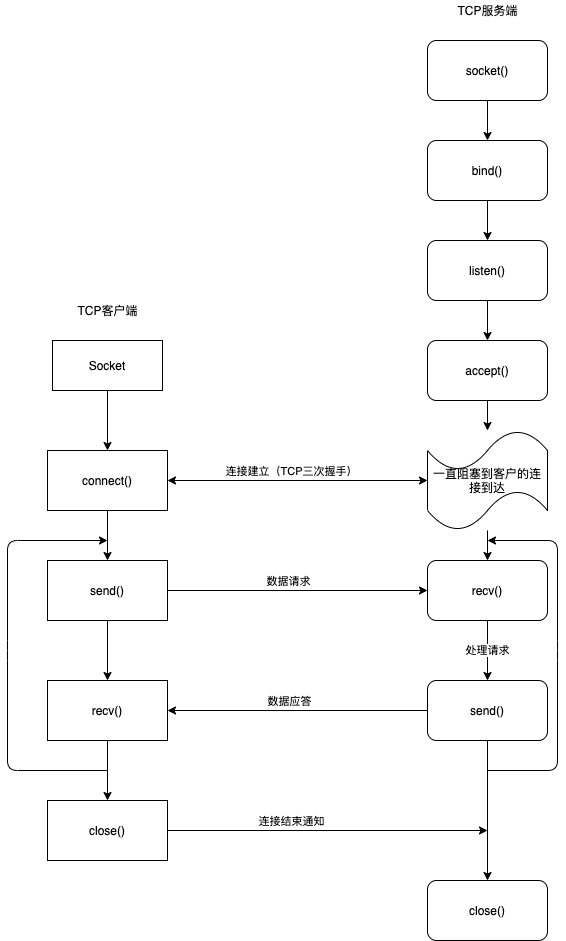

# 网络编程

TCP网络应用开发流程：





TCP client 代码：

```python
import socket

if __name__ == '__main__':
    # 创建tcp套接字
    c_socket = socket.socket(socket.AF_INET, socket.SOCK_STREAM)
    # 和服务器建立连接
    c_socket.connect(('127.0.0.1', 9090))

    while True:
        send_content = input('请输入你的内容：')
        if send_content == 'q':
            # 关闭连接
            c_socket.close()
            break
        # 把字符串进行编程成为二进制
        send_content = send_content.encode('utf-8')

        #发送数据
        c_socket.send(send_content)

        # 接收服务器返回的数据
        # 其中1024表示每次最大接收1024字节的数据。
        recv_data = c_socket.recv(1024)
        # 对服务器的数据进行解码
        recv_content = recv_data.decode('utf-8')
        print(recv_content)
```


TCP server 代码：

```python
import socket
import threading

# 处理客户端连接
def handle_client_socket(addr, new_sock):
    while True:
        # 接收来自客户端的信息
        recv_data = new_sock.recv(1024)
        if len(recv_data) == 0: # 表示客户端已经断开了
            print('客户端已经断开了', addr)
            break
        recv_content = recv_data.decode('utf-8')
        print(recv_content)

        # 发送数据给客户端
        send_data = '已经收到！'
        send_data = send_data.encode('utf-8')
        new_sock.send(send_data)
    new_sock.close()  # 终止与客户端的通信

if __name__ == '__main__':
    #创建服务器端套接字
    s_socket = socket.socket(socket.AF_INET, socket.SOCK_STREAM)

    # 设置端口号复用，即服务端程序退出，其bind的端口号立即释放。
    # 参数1：表示当前套接字
    # 参数2：设置端口号复用选项
    # 参数3：设置端口号复用选项对应的值，True表示复用端口号
    s_socket.setsockopt(socket.SOL_SOCKET, socket.SO_REUSEADDR, True)

    # 绑定端口号
    s_socket.bind(('', 9090))

    # 设置监听
    # 128 表示最大等待建立连接的个数
    s_socket.listen(128)
    print('ok')
    # 等待接受客户端的连接请求
    # 每次客户端与服务端建立连接成功都会返回一个新的套接字
    # s_socket 只负责等待接收客户端的连接请求，收发消息由新的套接字来处理

    while True:
        new_sock, addr = s_socket.accept()
        # 使用子线程去处理客户端的连接，这样就能同时处理多个客户端的连接。
        sub_thread = threading.Thread(target=handle_client_socket, args=(addr, new_sock))
        sub_thread.setDaemon(True)
        sub_thread.start()

    #如果这个被执行，表示服务端不再接收任何请求了。
    # s_socket.close()
```


当客户端或者服务器close掉套接字时，其返回的数据长度都是为0。 服务端可以通过返回数据的长度来判断客户端是否已经断开。